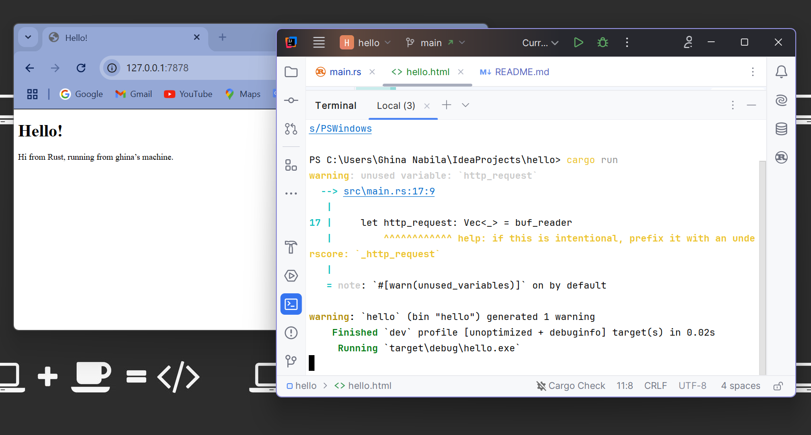
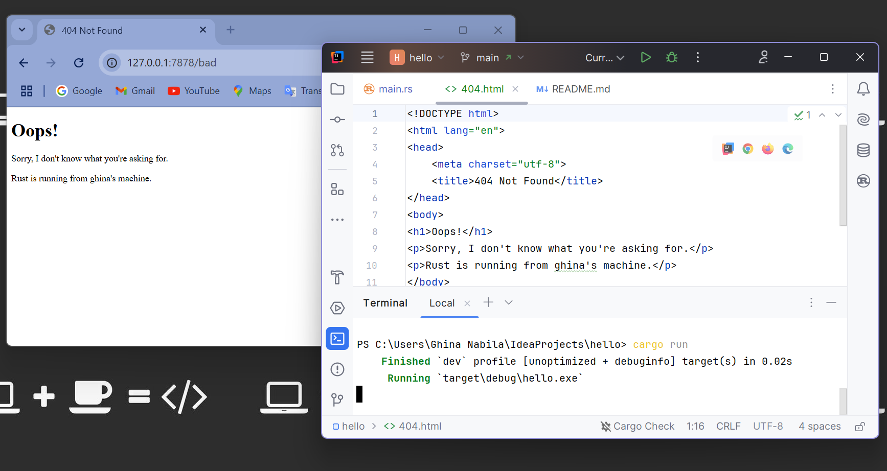

### Milestone 1: Single-Threaded Web Server

Pada Milestone 1 ini, saya membangun sebuah web server sederhana menggunakan bahasa pemrograman Rust. Server ini hanya menangani satu request dalam satu waktu (single-threaded), dan tujuan utamanya adalah untuk menampilkan HTTP request yang dikirimkan oleh browser ke server.
- **Membuat Server Web dengan Rust**: Menggunakan `TcpListener` untuk mendengarkan koneksi yang masuk di alamat `127.0.0.1:7878`.
- **Menerima dan Memproses Request**: Server menerima koneksi lalu memanggil function `handle_connection` untuk memproses HTTP request yang diterima.
- **Menampilkan HTTP Request**: Setiap request yang datang di print ke terminal supaya bisa dilihat detail HTTP request tersebut.

**Output HTTP request di terminal setelah mengakses `http://127.0.0.1:7878` melalui browser:**
```plaintext
Request: [
    "GET / HTTP/1.1",
    "Host: 127.0.0.1:7878",
    "Connection: keep-alive",
    "sec-ch-ua: \"Chromium\";v=\"134\", \"Not:A-Brand\";v=\"24\", \"Google Chrome\";v=\"134\"",
    "sec-ch-ua-mobile: ?0",
    "sec-ch-ua-platform: \"Windows\"",
    "Upgrade-Insecure-Requests: 1",
    "User-Agent: Mozilla/5.0 (Windows NT 10.0; Win64; x64) AppleWebKit/537.36 (KHTML, like Gecko) Chrome/134.0.0.0 Safari/537.36",
    "Accept: text/html,application/xhtml+xml,application/xml;q=0.9,image/avif,image/webp,image/apng,*/*;q=0.8,application/signed-exchange;v=b3;q=0.7",
    "Sec-Fetch-Site: none",
    "Sec-Fetch-Mode: navigate",
    "Sec-Fetch-User: ?1",
    "Sec-Fetch-Dest: document",
    "Accept-Encoding: gzip, deflate, br, zstd",
    "Accept-Language: en-GB,en;q=0.9,id;q=0.8,en-US;q=0.7",
]
```

Request tersebut menunjukkan kalau browser mengirimkan `GET` ke server pada alamat `127.0.0.1:7878`. Header HTTP juga terlihat, seperti `User-Agent`, `Accept`, dan lainnya.

**Apa _insight_ yang dipelajari:**
- **TcpListener**: Saya belajar cara membuat server yang mendengarkan koneksi menggunakan `TcpListener` pada Rust.
- **BufReader dan Memproses Request**: Server menggunakan `BufReader` untuk membaca aliran data dari koneksi dan mengambil baris-baris yang membentuk HTTP request.
- **HTTP Request**: Saya juga memahami struktur HTTP request, yang terdiri dari informasi seperti `User-Agent`, `Accept`, dan `Connection`.

---

### Milestone 2: Returning HTML
Pada milestone 2 ini, saya mengubah function `handle_connection` pada server supaya bisa mengirimkan konten HTML. Sebelumnya, server hanya menampilkan HTTP request di terminal, lalu di milestone ini, kita akan membuat server mengirimkan page HTML yang bisa dilihat di browser.
1. **Memodifikasi `handle_connection`:**
    - Function `handle_connection` diubah untuk membaca file `hello.html` dan mengirimkan isinya sebagai HTTP response.
    - Saya juga menambahkan header `Content-Length` untuk memberi tahu ukuran konten yang akan dikirimkan supaya browser bisa memprosesnya dengan benar.

2. **Membuat `hello.html`:**
    - Saya membuat file HTML baru dengan nama `hello.html`. File ini berisi struktur HTML sederhana yang menampilkan pesan `hello` di browser.

3. **Menguji Server:**
    - Setelah server diubah, saya menjalankannya menggunakan `cargo run` dan melihat hasilnya dengan mengakses `http://127.0.0.1:7878` di browser.
    - Hasilnya sesuai dengan harapan, page HTML dengan pesan "Hello!" berhasil muncul di browser.

**Screenshot:**
Berikut adalah screenshot hasil server yang menampilkan page "Hello!" di browser:



---

### Milestone 3: Validating Request and Selectively Responding

Pada milestone 3 ini, saya menambahkan logic untuk memvalidasi request yang datang ke server dan memberikan respons yang sesuai.
- Saya memodifikasi function `handle_connection` untuk memeriksa path yang diminta oleh user.
- Jika path yang diminta adalah `/`, server akan mengirimkan page `hello.html` dengan status `200 OK`.
- Jika path yang diminta adalah `/bad` atau path yang tidak valid, server akan mengirimkan page error 404 dengan status `404 Not Found`.

**Refactoring ini diperlukan karena:**
- Pada milestone sebelumnya, server hanya mengirimkan page `hello.html` tanpa memperhatikan apakah path yang diminta valid atau tidak. Pada milestone ini, saya membuat server lebih fleksibel dan memberikan respons yang sesuai dengan request yang diterima.
- Refactoring ini penting supaya server bisa menangani berbagai macam request dengan cara yang lebih profesional, seperti yang dilakukan oleh server web pada umumnya.
- Saya juga menerapkan beberapa prinsip seperti, 
    - **SOLID**: Functions yang lebih modular (`get_request_path` dan `generate_response_content`) membuat kode lebih mudah diperluas tanpa mengubah logika utama.
    - **DRY**: Pengulangan dalam pembuatan respons dan pengambilan path sudah dipisahkan menjadi functions terpisah.
    - **KISS**: Struktur kode tetap sederhana dan mudah dibaca dengan menggunakan fungsi terpisah untuk setiap bagian dari proses. 

**Screenshot:**
Berikut adalah screenshot hasil perubahan yang saya lakukan:



---

